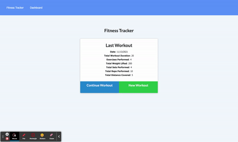

# Workout-Tracker-Nosql

Homework 14 - Unit 18 Nosql Homework: Workout Tracker

## what did I do?

This assignment required finishing the backend code for a workout tracker that involves a database. The user is allowed to log exercises with details over multiple days. The user can then look at a graph in their dashboard that details all of the information they have entered.

## what do I need to explain

This project was deployed on Heroku and uses MongoDB Atlas as a database.

## heroku deployment link

https://workout-tracker-bretpeters3n.herokuapp.com/

## animated GIF walk through

[]
